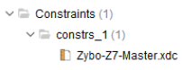
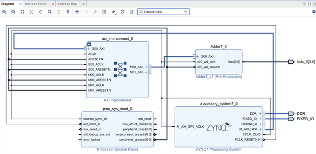
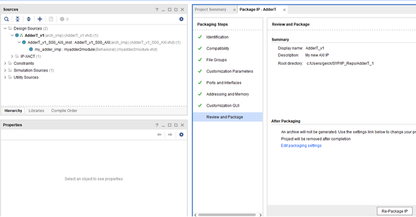
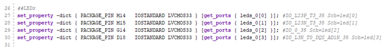
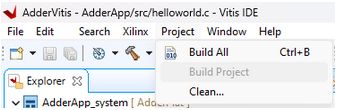
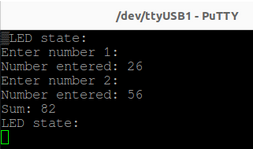

*Written By: Chris Anderson and Curtis Raymond*  
*Last Updated: November 29, 2023*  

# Using Vivado and Vitis
*This document describes how to use the Xilinx Vivado / Vitis software to implement an adder on the Zybo Z7-20 platform. The main system firmware will be established through an IP block diagram in Vivado that includes a custom IP core to support the adder. The software user interface will be created through Vitis that combines the Vivado hardware platform and provided C code to input an led control value and the two numbers to add.*
 

### Vivado 
Vivado is a tool which allows a user to program "hardware." This is done in 2 ways: Block Design or VHDL Code. Either method you use, it is important to note, they will both require a bit of VHDL code. To gain a better understanding of VHDL code, I recommend moving through [this tutorial](http://webdocs.cs.ualberta.ca/~amaral/courses/329/labs/VHDL_Reference.html#section1). There are a plethora of online tutorials that I ***HIGHLY*** recommend you work through, or at least those that will focus on Vivado and firmware. It is essential to have a decent grasp of Vivado and VHDL code to understand the current transmission chain.

##### What is VHDL Code?
VHDL stands for *VHSIC Hardware Description Language*.  
VHSIC stands for *Very High Speed Integrated Circuits Program*  

Understanding the naming convention can help to paint the picture of VHDL as "programming" circuits.

### Vitis
Vitis is another Integrated Development Environment (IDE). If you have never used an IDE before, they are are essentially a heavy text editor that do much more than just letting you edit text. This is important when programming microprocessors, as they will be build to a given board through the IDE.

---

###### IMPORTANT: Vitis is a good tool to understand how to test and experiment with a given block/VHDL code design, however, we use Petalinux, so Vitis is unnecessary for this project other than the aforementioned.

---

## Building the Adder Wrapper in Vivado
*This will be show on Windows OS, however, the process is directly convertible to Linux distributions.*
 

#### What you need:
+ Zybo Z7-20 or Zybo Z7-10 Development board
+ Computer with Vivado & Vitis installed
+ Followed the Vitis Vivado Setup Guide
+ Cable to connect board to Computer
 

#### Getting started

**1.** Create a new Vivado Project.
+ Save in a directory that minimizes path length.
+ Directory cannot have white spaces.
+ Avoid placing projects in the C:/Xilinx installation directory.
 
 

**2.** Select RTL (Register Transfer Level) file and no need to add design sources at the beginning.
 
 

**3.** Add a constraints file for the Zybo Z7-20 board. 
+ This can be retrieved from Digilent's GitHub page [here](https://github.com/Digilent/digilent-xdc/blob/master/Zybo-Z7-Master.xdc)
+ XDC - Xilinx Design Constraints File contains code needed for specific board pinouts and must be configured for the given project.  
 

 

**4.** Select board part.  
+ Best to select the entire ZyboZ7 board.  
+ You can download the ZyboZ7 board file (zybo-z7-20 or zybo-z7-10) from https://github.com/Digilent/vivado-boards. 
+ Add the board file to the Vivado installation through Xilinix>Vivado>2022.1>data>xhub>boards>XilinxBoardStore>boards>Xilinx (This is a new directory in recent versions).
 
 

**5.** Set Vivado target language to VHDL.
+ (Vivado can operate with either VHDL or Verilog).
 
 

**6.** Under IP integrator in the top left, click “Create Block Design”. 
+ This creates a blank IP block design pallet. 
 
 

**7.** Add the base IP packages provided by Vivado to configure the Zync7 processor, processor reset, and AXI interconnect. (AXI GPIO if desired) These are the pre-written VHDL packages that provide a baseline setup/configuration for any project with the ZyboZ7 Board.  
 
 

**8.** It is good to run block/connection automations when they pop up in the block design environment as the software knows how to configure the pre-written IP cores.
 

 

**9.** The main system clock is the Zynq7 FCLK_CLK0.
 
 

**10.** The validate design checkmark shown below can be used to check the block design.
 

 

**11.** Create new custom adder IP core. 
+ Can create a new custom IP core through Tools > create and package IP > Create AXI4 Peripheral > Edit IP.
+ Existing IP blocks can be edited/viewed in depth by right clicking on the IP > Edit in IP packager.
+ The VHDL code for each of the three adder IP hierarchy’s is included in the corresponding named txt files. Comparing these codes to the original defaults will allow for all needed changes to be made.   
+ It is important to re-package the IP after any changes are made and the packaging steps should show green checkmarks if done correctly.

 

 

**12.** Once adder IP is finished, add it to the block diagram and run connection automation.
+ Once added, right-click on the leds[3:0] port and “make external” 
 
 

**13.** Wrapping block design. Once the block design has been completed, right click on the block design icon and click “Create HDL Wrapper” and let Vivado manage updates.
+ Sometimes need to manually create wrapper again for it to properly update.
 
 

**14.** Update Zybo_Z7_master constraints file to reflect the design. 
+ Uncomment the needed lines as shown below and update port names for the specific project. 
 

 

**15.** Once overall project is finished, run RTL analysis (creates schematic), run synthesis, implement design, and finally generate the bitstream. 
 
 

**16.** Once the bitstream is complete, go to File > Export Hardware > Include Bitstream which will export an XSA file to be used in Vitis.
+ XSA - Xilinx Support Archive - Vivado firmware file exported to Vitis (platform project)   
 
 

**17.** Load Vitis and create a new platform project that will utilize the XSA file from Vivado.
+ Can create a completely new Vitis project by providing a new workspace folder directory.
 
 

**18.** Create a new application project that refers to the platform project.
+ Select a Hello World application and click finish.  
 
 

**19.** Navigate to src>helloworld.c and replace the helloword code with the code provided in the Vitis_Adder_C_code_UI.txt file.
 
 

**20.** Open the xparameters.h library and find the base address definition statement for the specific Vivado project adder IP.
 

 

**21.** Build the entire project using the Build All button as shown below. 
 

 

**22.** Once the Vitis project is built, connect to the ZyboZ7 by plugging into the PROG UART micro-USB and connect to the board through a serial terminal.
+ Two options for serial connection are the Vitis Serial Terminal or Putty terminal.
+ The Vitis Serial Terminal can be loaded by clicking “Window”>”Show View” and then searching the serial terminal.
+ Find the associated device Com port for windows or /dev/ttyUSB port for Linux and connect with a baud rate of 115200.
 
 

**23.** Once connected through the serial connection, click the green play button to program the ZyboZ7. The green Done light should turn on once successfully programmed and “LED state” should appear on the serial terminal. 
 
 

**24.** Interact with the UI to provide the LED state and numbers to add as shown below.
 

 

---

### Congrats, you have just built your first project with Vivado and Vitis!

---

### NOTE: Vivado project should look similar to the [Adderwrapper2.zip](./Adderwrapper2.zip)