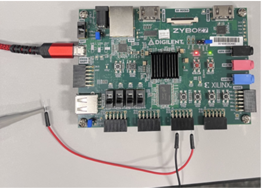

*Written by: Curtis Raymond*  
*Last Updated: November 30, 2023*
 

## Modulation Chain Verification
This document will house the steps we took to verify the current transmission chain, provided by Dr. Bousquet. 
 

### Running Base Modulation Chain in Vivado
The full Vivado modulation chain project file is BFSK_Transmitter_DCA located in Dr. Bousquet’s ZyboAcousticComm folder.
 

 
The file can be opened in Vivado and re-built up to the bitstream on your computer. Make sure that you have the ZyboZ7 10 or 20 board file in the correct Xilinx directory. Once the bitstream has been successfully generated, connect to the ZyboZ7 through the prog uart with jumper JP6 set to USB and jumper JP5 set to JTAG. Now click on open target > auto connect to connect to the ZyboZ7.
 

 
Once connected and in the Hardware Manager, click program device to program the ZyboZ7.
 

 
Once the device has been programmed, connect an oscilloscope to the PDM output signal which is pin V15 or pin 1 of Pmod Header JC.  
 

 
The final test setup and PDM oscilloscope output can be seen below.
 

 

### Connecting Filter Board and Power Supply
The filter board op-amps are powered with a +/- 12V DC supply that is configured as shown below. Two 12V supplies are configured by connecting the minus terminal of one to the plus terminal of the other to create a common ground and the respective +/-12V polarities. The +/- 12V probes and common ground must be connected to the filter board.  
 

 
The filter board takes the pulse density modulated signal from the ZyboZ7 on the J1 connector with signal (purple) and ground (orange) wires. The final signal is output at J2 with signal (red) and ground (brown) wires. For the power supply, the U3 orange wire is 12V and the U3 green wire is -12V. 
 

The filtered only output can be measured across the terminals of R3 and the filtered + op-amp amplified signal can be measured at the J2 terminal.

### Signal Verification
There are several possible ways to verify the signal at the output of the transmit chain. It was decided to utilize Dr. Bousquet’s existing ZyboZ7 setup to transmit pre-written wave files that have been loaded into an SD card. The filtered output was measured with two oscilloscope channels at the input and output of the filter board op-amp circuit. The oscilloscope outputs were captured and saved in csv format so they could be compared through Matlab to the original SD card wave files with appropriate signal processing.
 

 

Important points for capturing the transmitted data on the oscilloscope: 

+ Very important to capture at the beginning of a frame transmission. This can be accomplished by using the single capture/trigger button on the oscilloscope.  
+ Adjust the oscilloscope trigger position so that it will trigger the single capture only when the data is transmitted.  
+ Adjust the oscilloscope timescale to capture a reasonable amount of data while still respecting Nyquist sampling resolution. 

 

Two test wave files were transmitted named sin_0p1sec_fc27500 and sin_sec_fc2p75 that transmitted a high frequency sine wave (27500Hz) and a low frequency sine wave (2.75Hz). A picture of the oscilloscope capture of the low frequency sine wave is shown below. 
 

The low frequency sine wave capture demonstrates significant distortion at the signal peaks from the pulse density modulator and filter combination. Matlab signal processing and comparison is still required to make final observations on the transmitter signal quality.  