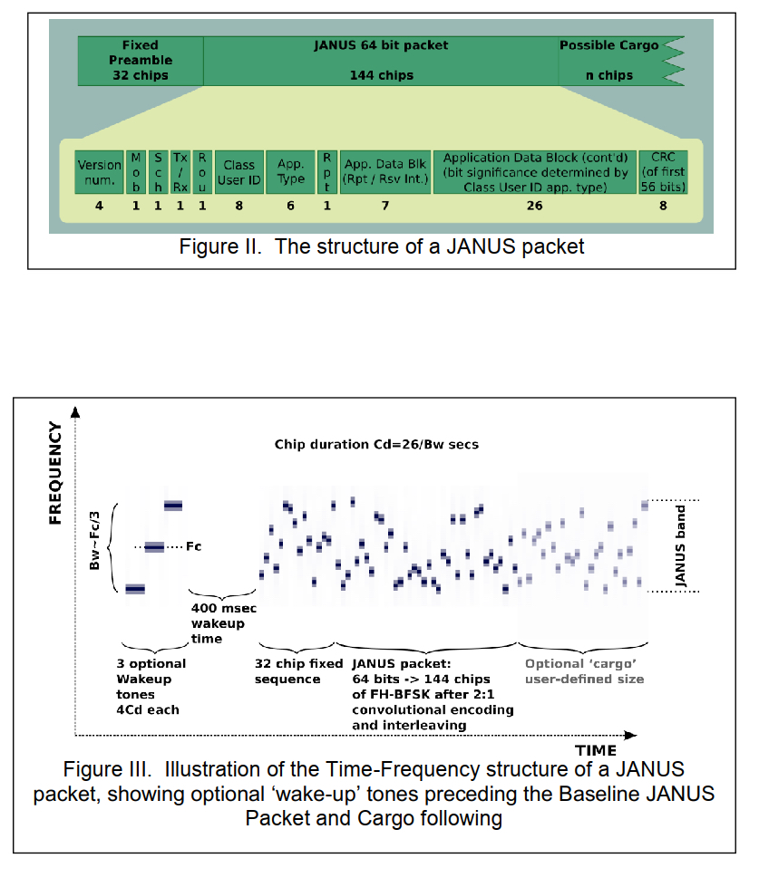

*Written By: Chris Anderson*<br>
*Last Updated: November 20, 2023*

<br>

# JANUS: *The NATO Standard that Defines Underwater Communication*
*The following images are from ANEP-87.*
<br>
As stated previously, JANUS is a NATO standard that details how data should be transmitted in the underwater channel. The full extent of JANUS and the protocol it entails is extensive, but the general idea of it is explained in this module.
<br>
<br>
The general flow chart of what happens with JANUS is shown below.


### Transmission Sequence Generation
This sequence can be summed up to be how the user data is encoded. The user data is appended to the JANUS bit stream packet, then is passed through a Cyclic Redundancy Check (*CRC*) module. From there, it is passed to a convolutional encoder with a 2:1 redundancy (meaning for each 2 bits, 1 bit is redundant). Finally, it is interleaved with the carrier frequency.
<br>
<br>

##### Assembling JANUS bit stream
This is something that is the entire point of JANUS. To describe what message is being sent and how it should be handled. The image below shows the actual bit allocation table provided with JANUS in ANEP-87. This is important to have, as it one of the main implementations of JANUS, aside from the BSFK and FH. Setting up a system to create this packet whenever data is entered to be transmitted is a ***MUST***.
<br>


<br>

##### CRC
Cyclic Redundancy Check (CRC) is used to prevent data corruption over a channel. For this implementation of JANUS, an 8-bit CRC is used. CRC is a method of preforming a mathematical operation (bit-wise division) given a known key to the message to be transmitted. This resultant is then appended to the message as check bits. This must be done for the JANUS packet, but does not necessarily need to be done for the cargo packet, as this is a non-stop stream of information bits. 
<br>
For this, CRC-8 should be used. This uses a key of *0xD5*. This is used to perform the bitwise division on the JANUS packet to obtain the CRC bits to be appended on the end.
<br>

An example of this was created and can be found [here](./CRC_Example.py). However, the basic pseudo code will be below.
<br>
```python
for i in range(LENGTH OF PACKET):
    if INPUT PACKET in RANGE OF VALUES:
        INPUT PACKET XOR (^) DIVISOR
        DIVISOR >>= 1
    else:
        DIVISOR >>= 1
```
This, with some other operations, will create the desired CRC for a given packet.
<br>
<br>

##### Convolutional Encoder
This process is done for us. This works exactly how you would think it would work. It encodes the JANUS packet with a 2:1 redundancy (For every two bits transmitted, one is to ensure its received correctly). The actual process that is going on here is somewhat complex to explain in greater detail, however, there is a large amount of education documentation online for this topic. One such can be found [here](http://web.mit.edu/6.02/www/f2010/handouts/lectures/L8.pdf) 

##### Interleaver
If you've never heard this term before, it can sound somewhat intimidating. The interleaver actually does something rather simple. The best and only way that I have been able to understand it is with the following diagram from [RF Wireless World](https://www.rfwireless-world.com/Terminology/Advantages-of-Interleaving-in-Data-Communication.html). This clearly explains it, and the visual below shows exactly what is happening to prevent burst errors from corrupting the data being transmitted.
<br>
<br>

<br>
<br>

### Waveform Generation
This is where the main sequencing of the transmission comes from. The frequency-hopping is introduced to map to each symbol. The 32-bit preamble is also created. To sum up the portion of the JANUS baseline packet encoding, it is where "pre-transmission" packets are created, including the wake-up tones, 32-bit preamble (which initializes the frequency hopping), chip windowing and/or tukey window, before finally being sent to the transducer.
<br>
<br>
This is an important part of JANUS. This needs to be understood. The implementation we started with began at the CRC generator. This means that to implement an *ACTUAL* JANUS protocol in the system, our input data must be altered to meet the criteria. This must be done, following the JANUS bit allocation table, shown below (This table is broken down in greater detail in ANEP-87).

##### Wake-up Tones (Optional) and 32-bit Sequencing
An aspect of the power reduction of JANUS is how it interacts with receivers and nodes. These nodes will be *sleeping*, or in a low power usage state when not in use and must be *awoken* by certain, preset tones. There is then a period where the node or receiver is given time to *wake up*. Then, there is a 32-bit sequence that essentially initializes the frequency hopping.
<br>
The sequence is as follows:
<br>
&emsp;&emsp;***{1,0,1,0,1,1,1,0,1,1,0,0,0,1,1,1,1,1,0,0,1,1,0,1,0,0,1,0,0,0,0,0}*** <br>
After this sequence, the JANUS packet (*according to the bit allocation table*) is sent, followed by the cargo data. This is the data flow of JANUS.  Below is the data packet makeup for JANUS, followed by the frequency vs. time plot.
<br>




##### Tukey Window
This where where the filter board and amplifier of the project come into play. This will specify how the final transmitted wave will appear. In other words, how long each window of data transmission will take. For example, if I have a bit of value '1' and it's being transmitted with a frequency of 11200 Hz, I must specific how long this frequency will last. This is defined by the filter board. 

#### Bringing this all together
When we bring this aspects of data transmission, we have a work JANUS compatible transmission chain. This is essential, as *Ultra* has defined the ACOM Transmitter must be JANUS compatible. 
<br>
<br>

Some other import side notes to make about the process as a whole.
+ The Wake-up tones are followed by a period of silence to allow for the node/receiver to *wake up*
+ The 32-bit preamble are followed immediately by the JANUS header packet. 
    + This is then immediately followed by the cargo data (If additional data must be transmitted)
+ JANUS details how it operates on a bandwidth of 9440-13600 Hz
    + Noted in ANEP-87, this is more so a ***recommendation*** for use with NATO members ***rather than a MUST***
+ The ***cargo data can be of any length***, but must be appended to the header packet
<br>

---

## Learning more about JANUS
To gain a better understanding of this, I recommend you download the actual NATO standard, promulgated by ***STANAG 4748***. This actual standardized document of the method is called ***ANEP-87***. This can be downloaded from wherever you can find it, however, **[this link](https://infostore.saiglobal.com/en-us/standards/anep-87-2017-737592_saig_nato_nato_1791960/)** provides you with a free download DRM'ed PDF version.
<br>
<br>
Simply create an account (free) and download (free). Keep in mind, this is a DRM file, meaning that once you download it, you are not able to copy or paste it. While I don't know to the fullest extent of how this works, I was able to save it from the web to my OneDrive. From there I can access it from all my devices I log into.
<br>

###### DISCLAIMER: I didn't even know that this would work, and I cannot recommend what you do with the file. I am just saying what I did.
<br>
I highly recommend this to be one of the first this that you do, as without it, you will not fully understand what the system is doing or why. Without knowing what or why, it's very difficult to develop the system further.
<br>

---

## References
NATO. (2017, March 24). ***ANEP-87*** *Digital underwater signalling standard for network node discovery & interoperability.* Retrieved from **saiglobal.com**
<br>
