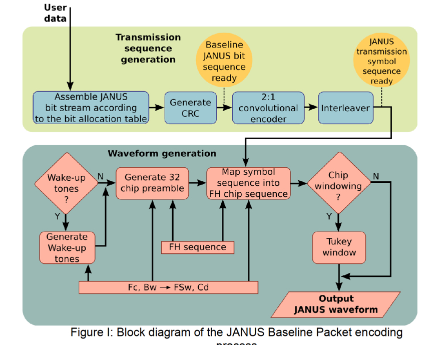
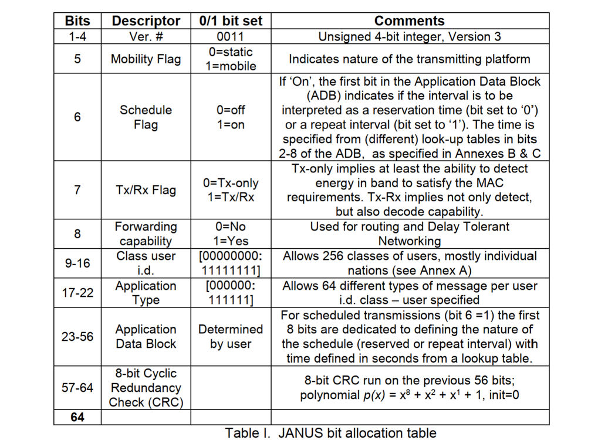
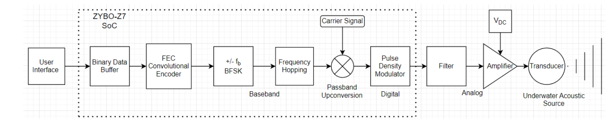

*Written By: Chris Anderson*<br>
*Last Updated: November 18, 2023*

# Capstone Project: *ACOM Transmitter FPGA Development*
This is a project collaboration between Dalhousie University and Ultra Maritime ( *Nova Scotia's division of Ultra Electronics* ). The full project is to develop a transmitter chain to take user data to send across the underwater channel to the sister project, the ACOM Receiver. 
<br>
<br>
This project has had many hands on it over the years, most recently, as our capstone project. This repository is a collection of documentation and knowledge that we have gained over the duration of our time working on it. This README\.md file will detail the scope of the project as it stands, as well as, what each module (directory) entails. 
<br>

---

## Project Scope
The aim of this project, as briefly stated above, is to create an Acoustic Modem (ACOM) Transmitter by means of an FPGA board. This system will take input data, encode it, and modulate the signal, all in accordance with JANUS standards. It will finally be sent through a transducer to be transmitted across an underwater channel to a receiver.
<br>
<br>

#### JANUS
*The following images are from ANEP-87.*
<br>
<br>
Understanding JANUS is a very important part of the project. Luckily, the hard part of JANUS is done for us, for the most part, that being the actual wave modulation and encoding (hard for me at least). 
<br>
<br>

##### What is JANUS?
JANUS is a NATO standardized method of communicating in the underwater channel. This could also be considered transmitting data via the underwater channel. To put it into simple terms, the JANUS protocol uses packet headers, similar to how internet packets work. Each sequence of bits has a different meaning for a node or receiver to understand, for instance, whether a message is an emergency distress signal, or just a friendly acknowledgement. These packets can also have the *cargo data* or payload/information we want to transmit.
<br>
<br>
These packets then go through the defined JANUS transmission sequence generation, then waveform generation. 

##### Transmission Sequence Generation
This sequence can be summed up to be how the user data is encoded. The user data is appended to the JANUS bit stream packet, then is passed through a Cyclic Redundancy Check (*CRC*) module. From there, it is passed to a convolutional encoder with a 2:1 redundancy (meaning for each 2 bits, 1 bit is redundant). Finally, it is interleaved with the carrier frequency.
<br>
<br>


##### Waveform Generation
This is where the main sequencing of the transmission comes from. The frequency-hopping is introduced to map to each symbol. The 32-bit preamble is also create. To sum up the portion of the JANUS baseline packet encoding, it is where "pre-transmission" packets are created, including the wake-up tones, 32-bit preamble (which initializes the frequency hopping), chip windowing and/or tukey window, before finally being sent to the transducer.
<br>
<br>
The general flow chart of what happens with JANUS is shown below.



This is an important part of JANUS. This needs to be understood. The implementation we started with began at the CRC generator. This means that to implement an *ACTUAL* JANUS protocol in the system, our input data must be altered to meet the criteria. This must be done, following the JANUS bit allocation table, shown below (This table is broken down in greater detail in ANEP-87).



##### So what does this all mean? 
This means that whenever we want to send a transmission, the first part of that transmission, *or packet*, must have the first 64 bits defined by the bit allocation table. The follow "cargo" data can be of any length, and does not require any other such bit allocations. It is important to note that the cargo can follow the same convolutional encoding and interleaving, however, they are separately encoded and interleaved. There must ***NOT*** be ***ANY*** delay from the JANUS baseline packet and the cargo packet.
<br>
<br>

##### Wake-up Tones and 32-bit Sequencing
An aspect of the power reduction of JANUS is how it interacts with receivers and nodes. These nodes will be *sleeping*, or in a low power usage state when not in use and must be *awoken* by certain, preset tones. There is then a period where the node or receiver is given time to *wake up*. There is then a 32-bit sequence that essentially initializes the frequency hopping.
<br>
The sequence is as follows:
<br>
&emsp;&emsp;***{1,0,1,0,1,1,1,0,1,1,0,0,0,1,1,1,1,1,0,0,1,1,0,1,0,0,1,0,0,0,0,0}*** <br>
After this sequence, the JANUS packet (*according to the bit allocation table*) is sent, followed by the cargo data. This is the data flow of JANUS.  Below is the data packet makeup for JANUS, followed by the frequency vs. time plot.


An observation to note is that the JANUS protocol states that it is to operate at *9440-13600Hz*. However, it does go on to say that there is a possibility that it could run at higher or lower frequencies.
<br>
<br>

To gain a better understanding of this, I recommend you download the actual NATO standard, promulgated by ***STANAG 4748***. This actual standardized document of the method is called ***ANEP-87***. This can be downloaded from wherever you can find it, however, **[this link](https://infostore.saiglobal.com/en-us/standards/anep-87-2017-737592_saig_nato_nato_1791960/)** provides you with a free download DRM'ed PDF version.
<br>
<br>
Simply create an account (free) and download (free). Keep in mind, this is a DRM file, meaning that once you download it, you are not able to copy or paste it. While I don't know to the fullest extent of how this works, I was able to save it from the web to my OneDrive. From there I can access it from all my devices I log into.
<br>

###### DISCLAIMER: I didn't even know this would work, I cannot recommend what you do with the file, I am just saying what I did.
<br>
I highly recommend this to be one of the first this that you do, as without it, you will not fully understand what the system is doing or why. Without knowing what or why, its very difficult to develop the system further.
<br>


---

## Current Project Developments (As they were when we started)
<p>
This project, as stated above, is to develop a working transmitter chain. Thus far, the system we were given includes: 
</p>

+ On the FPGA
    + PN Binary Generator
    + Binary Data Buffer
    + Forward Error Correction (FEC) Convolutional Encoder
    + Binary Frequency Shift Keying (BFSK)
    + Frequency Hopping
    + Passband Upconversion
        + This is where the carrier signal is introduced
    + Pulse Density Modulator (PDM)
+ External from the FPGA
    + Filter Board
    + Signal Amplifier
    + Transducer <br> 
<p>

&nbsp;
</p>
<p>
As the project stands, our current plan was to replace the PN Binary Generator and Binary Data Buffer and replace them with a Memory Controller. What this would do is take data from memory in blocks of 1024 bits, and send them down the chain. 
</p>
<p>
What this would mean is that rather than developing code in Vitis, we would opt to use Petalinux to create an OS on the FPGA. This would allow us to write a driver to write to memory with a bash command like: <br> 
</p>

```echo "Hello world!" > driver``` <br>

<p>
This would leave a great deal of room for configuration, which is something the project sponsor, Ultra, was interested in.
</p>


## References
NATO. (2017, March 24). ***ANEP-87*** *Digital underwater signalling standard for network node discovery & interoperability.* Retrieved from **saiglobal\.com**