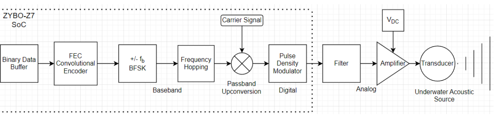

*Written By: Chris Anderson*<br>
*Last Updated: November 20, 2023*

# Capstone Project: *ACOM Transmitter FPGA Development*
This is a project collaboration between Dalhousie University and Ultra Maritime ( *Nova Scotia's division of Ultra Electronics*). The full project is to develop a transmitter chain to take user data to send across the underwater channel to the sister project, the ACOM Receiver. 
<br>
<br>
This project has had many hands on it over the years, most recently, as our capstone project. This repository is a collection of documentation and knowledge that we have gained over the duration of our time working on it. This README\.md file will detail the scope of the project as it stands, as well as, what each module (directory) entails. 
<br>

---

## Project Scope
The aim of this project, as briefly stated above, is to create an Acoustic Modem (ACOM) Transmitter. This will use the following components: FPGA board, filter circuit, amplifier circuit, and underwater transducer. This system will take input data, encode (error correction), modulate, filter (D/A converter), amplify, and transmit, all in accordance with JANUS standards. 
<br>
<br>
This document will gloss over many of the important aspects that are required to know when stepping into the project. Specifically, each aspect of the project that may be unknown or new to you.

---

## Background
*This section will provide you with the necessary information on the background of the device, how and why it works, what is needed, etc. This an important part of the project, as actually understanding what the system does and needs to do is important to continue the design work.*

### ACOM Transmission
An Acoustic Modem, or ACOM, is a transmitter that employs a method of data transmission that does exactly what the name tells. It communicates via acoustic waves, rather than radio or microwave. The image below shows this idea illustrated with how it *could* be used with an underwater Remote Operated Vehicle (ROV). While there is a wide range of uses, including an alternative to laying telecommunication lines, it is important to note that ACOM transmission is much slower than traditional methods of data transmission. While water has a greater speed of sound when compared to air, it's attenuation is much greater. This can (*and does*) cause a great deal of data loss and scattering of signals, making it difficult to, not only receive the data, but to ensure that it isn't being received multiple times at incorrect times.
<br>


<br>
This is where Binary Frequency Shift Keying (BFSK) and Frequency Hopping (FH) come into play. Utilizing these two operations allow for data to not only ensure that it is being received properly, but also that it is not being obtained at improper times. 
<br>
<br>

#### Binary Frequency Shift Keying (BFSK)
This is a complex idea to really get a hold on, so I would suggest putting some of your own research into the topic. 
<br>
<br>
In it's simplest form, BFSK is a way to note 0's and 1's as varying frequencies. For example, if I have a center frequency of 1000Hz, my 0 may be represented by 900Hz and my 1 may be represented by 1100Hz. 
<br>
<br>

#### Frequency Hopping (FH)
FH is another somewhat complex idea, so, again, I would suggest putting some research to getting a good hold on the idea. 
<br>
<br>
FH is a almost exactly what it sounds like. Each bit is to be transmitted at one of thirteen different frequencies within the JANUS bandwidth. This works along with BFSK. 
<br>
<br>

#### When we use them together
For an idea of how this may work in practice, please see below in the code section. It is important to note that this has been done for us my previous developments, however, verification is always a good thing.
```python
info                    = 0b00111011
carrier_freq            = 11520     # Hz
FH_bound                = 80        # Hz

# In addition to these frequencies, there are 5 others that are unused
# #####################################################################
# bit 7 = 0 
center_freq_7           = 11840     # Hz
bit_7_transmission_freq = center_freq_7 - FH_bound
# bit 6 = 0 
center_freq_6           = 11520     # Hz
bit_7_transmission_freq = center_freq_7 - FH_bound
# bit 5 = 1 
center_freq_5           = 11200     # Hz
bit_7_transmission_freq = center_freq_7 + FH_bound
# bit 4 = 1 
center_freq_4           = 10880     # Hz
bit_7_transmission_freq = center_freq_7 + FH_bound
# bit 3 = 1 
center_freq_3           = 10560     # Hz
bit_7_transmission_freq = center_freq_7 + FH_bound
# bit 2 = 0 
center_freq_2           = 10240     # Hz
bit_7_transmission_freq = center_freq_7 - FH_bound
# bit 1 = 1 
center_freq_1           = 9920      # Hz
bit_7_transmission_freq = center_freq_7 + FH_bound
# bit 0 = 1 
center_freq_0           = 9600      # Hz
bit_7_transmission_freq = center_freq_7 + FH_bound
```


<br>

#### JANUS
*Understanding JANUS is a very important part of the project. Luckily, the hard part of JANUS is done for us, that being the actual wave modulation and encoding (hard for me at least).*
<br>

##### What is JANUS?
JANUS is a NATO standardized method of communicating in the underwater channel. In simpler terms, it defines how NATO countries should send data underwater. 
<br>
<br>
The JANUS protocol details the use of *wake-up tones*, *32-bit preamble*, and *header packet* (with optional appended *cargo data* or payload). The packet headers are almost the same idea as to how internet packets work. Each sequence of bits has a different meaning for a node or receiver to understand, for instance, whether a message is an emergency distress signal, or just a friendly acknowledgement. These packets can be used to communicate a given message, or transmit detailed information in the appended cargo data section.
<br>
<br>
These packets then go through the defined JANUS transmission sequence generation, then waveform generation. To get a better idea of how JANUS works, please see the [JANUS module](/JANUS/README.md).
<br>

---

## Current Project Developments (As they were when we started)
<p>
This project, as stated above, is to develop a working transmitter chain. Thus far, the system we were given includes: 
</p>

+ On the FPGA
    + PN Binary Generator
    + Binary Data Buffer
    + Forward Error Correction (FEC) Convolutional Encoder
    + Binary Frequency Shift Keying (BFSK)
    + Frequency Hopping
    + Passband Upconversion
        + This is where the carrier signal is introduced
    + Pulse Density Modulator (PDM)
+ External from the FPGA
    + Filter Board
    + Signal Amplifier
    + Transducer <br> 
<p>

&nbsp;
</p>
<p>
As the project stands, our current plan was to replace the PN Binary Generator and Binary Data Buffer and replace them with a Memory Controller. What this would do is take data from memory in blocks of 1024 bits, and send them down the chain. 
</p>
<p>
What this would mean is that rather than developing code in Vitis, we would opt to use Petalinux to create an OS on the FPGA. This would allow us to write a driver to write to memory with a bash command like: <br> 
</p>

```echo "Hello world!" > driver``` <br>

<p>
This would leave a great deal of room for configuration, which is something the project sponsor, Ultra, was interested in.
</p>

---

## References
NATO. (2017, March 24). ***ANEP-87*** *Digital underwater signalling standard for network node discovery & interoperability.* Retrieved from **saiglobal.com**
<br>
<br>
Wikipedia. (n.d.). *Cyclic Redundancy Check*. Retrieved from **https://en.wikipedia.org/wiki/Cyclic_redundancy_check**