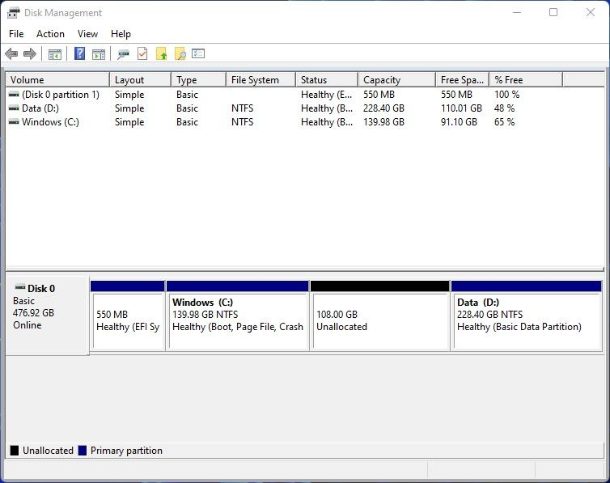

*Written by: Chris Anderson* <br>
*Last Updated: November 16, 2023*

# Setting up test Environment
To utilize any tools for this project, it is important to note that a *specific* environment is required. This being a **Linux** distribution.  Vivado and Vitis are available for Windows OS and certain Linux distributions. Petalinux is **ONLY** available for Linux distributions. Below is a list of OS's that can be used. <br>

Vitis is available on:  <br>

- RHEL/CentOS 7.4, 7.5, 7.6, 7.7, 7.8, 8.1, 8.2
- RHEL 8.3
- Ubuntu 16.04.5, 16.04.6, 18.04.1, 18.04.2, 18.04.3, 18.04.4, 20.04, 20.04.1 LTS
- Amazon Linux 2 AL2 LTS
- SUSE Enterprise Linux 12.4
- Windows 10 64-bit Professional and Enterprise versions 1809, 1903, 1909, and 2004


Petalinux is available on: <br>

- Red Hat Enterprise Workstation/Server 7.4, 7.5, 7.6, 7.7, 7.8 (64-bit)
- CentOS Workstation/Server 7.4, 7.5, 7.6, 7.7, 7.8 (64-bit)
- Ubuntu Linux Workstation/Server 16.04.5, 16.04.6, 18.04.1, 18.04.2, 18.04.3, 18.04.4(64-bit)

With this being noted, the work for this project had been done on Ubuntu 22.4.3 LTS. This has not caused any issues with any operations of software, however, this is important to note as some errors could occur due to this. <br>

Moving on to actual requirements for the software. As per Xilinx, it is recommended to have a minimum of 16GB of RAM with 100GB of storage. *However*, in practice, we have found that you require more than 256GB to actually install Xilinx suite products. Therefore, if your system does not contain these, can a powerful CPU, it is recommended to use the lab computers. For this, please see the internal supervisor. <br>

---

###### IMPORTANT: All steps remain the same, until the last section of updating Ubuntu, may be different if not Debian distribution.

---

## Installing a Ubuntu Distribution
*Skip if you already have a Linux distribution*
Getting the initial info out of the way, we can move to actually setting up the test environment. This section will contain instructions on how to partition a storage drive, prepare a boot drive, and installing Ubuntu 22.4.3 LTS. This will be done in steps, this also assumes you have Windows installed as your OS.

### Partitioning
Partitioning is the process of creating partitions of a storage drive. If you do not have another drive to use, you must *dual-boot* your system. If looking to *dual-boot*, you must partition **PRIOR** to attempting the remainder sections. <br>

---

###### IMPORTANT: Another guide to setting up a dual-boot with Windows and Ubuntu can be found at [FreeCampCode](https://www.freecodecamp.org/news/how-to-dual-boot-any-linux-distribution-with-windows/)

---

##### What you need
+ Computer/laptop you wish to dual-boot or change OS
+ USB drive or equivalent storage device of 8-16GB
+ Download the image file (For Ubuntu, you can use this **[link](https://ubuntu.com/download/desktop)**)

1. Open *Create and format hard drive partitions*.
2. Shrink a pre-existing volume.
    + Only do this is you do not have a new drive.
3. Ensure your drive looks like this:



4. You have now partitioned your storage drive to be used for a dual-boot. Congrats!

### Setting up a boot drive
Now that you have a partition for Ubuntu to install to, you need a drive to install from. That can be any external storage device, but must be at least 8-16GB. 
<br>

1. Install an image burning software, we have used **[Rufus](https://rufus.ie/en/)**.
2. Insert the storage drive into your computer, then start **Rufus**.
3. Now, select the image file (.iso) we want to use. This is the one we downloaded from Ubuntu above. 
4. Select the drive you want to "burn" the image to. Make sure to select the external storage device. 
5. After running Rufus, you now have a boot drive that can be used to install Ubuntu. Congrats!

### Installing Ubuntu
After completed the previous sections, you now have the means to install Ubuntu onto your device. Follow the next few steps on how to install Ubuntu. <br>

1. Shutdown device.
2. Insert boot drive.
3. Turn on device.

---

###### **IMPORTANT:** Some computer's BiOS will recognize the boot drive immediately, some will not. If it does not prompt you to *Try Ubuntu* or *Install Ubuntu* and just starts up Windows as normal, determine how to open BiOS on your device, this could be done by pressing F12 or F10 or DEL repeatedly while booting.

---

4. Select *install Ubuntu*.
5. Follow all the steps that are required, such as, creating an account, setting timezone, setting partitions.
    + If prompt with setting partitions for boot and filesystems, set boot for 24GB and the rest for the filesystem, however, this should not occur.
6. Once you reach the end of these options, you will be given a loading screen where Ubuntu will *actually* install. Wait for this to complete.
7. Congrats, when it's done installing, you have successfully dual-booted Windows OS and UBuntu 22.4.3 LTS.

**Congrats**, you have not completed the dual-boot setup and installation process.

### Accessing Ubuntu and Windows
With dual-booting, your BiOS must now manage 2 different boot drives. In practice, when you install from scratch, whenever you turn on your device, it should prompt an option of booting Windows OS or Ubuntu OS. <br> <br>
If this is **NOT** the case, you will need to open your BiOS each time you wish to boot Ubuntu and select the boot partition for Ubuntu.

---

## Setting up Ubuntu
Now that you have a Linux distribution install and runs, we can now begin to prepare the system for actual use. This is primarily done by installing required libraries. <br>
The last step in this process is updating Ubuntu itself. <br>
&emsp;```sudo apt update``` <br>
&emsp;```sudo apt upgrade``` <br>
These commands should be run every few weeks as to keep Ubuntu's system up-to-date.
<br>
<br>
Make will be required for using Vitis down the road, and any other makefiles you wish to create on the Ubuntu system. For this, enter the following command: <br>
&emsp;```sudo apt install make```
<br>
There are many other dependencies and libraries that may be required. A simple error log may be telling of potential issues that may arise down the road. The *sudo apt install* bash line works well for most distribution recognized libraries and dependencies.
<br>
<br>

