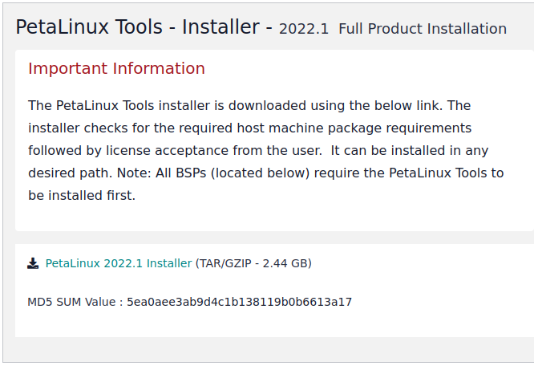
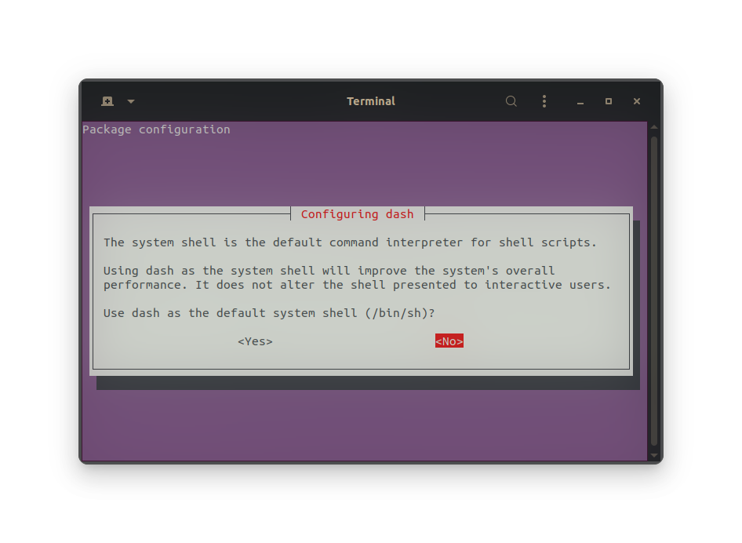

*Written By: Chris Anderson* <br>
*Last Updated: November 16, 2023* <br>

# Installing Petalinux

This process will take a long time. This should be completed after the installation of Vitis and Vivado. <br>

**NOTE:** This is not required for Vitis and Vivado development. This is only for building an operating system. Theoretically, this only needs to be done once. 
<br>
<br>
This installation guide will show a step-by-step guide on installing Petalinux. As with Vitis and Vivado, Ubuntu 22.4.3 LTS is not an officially support OS for Petalinux. <br>
Throughout my time using Petalinux, there was not a specific issue that arose from using a more current version of Ubuntu, however, it will display many warnings. 

---

### What is Petalinux
Petalinux is a tool developed by Xilinx that works off of Yocto Linux distribution. What it does is create a custom Linux OS. While there is a great deal of configuration available with it, it creates an extremely bare bones and basic Linux OS. <br> <br>
This is essential for the project. The micro-controller used throughout this project thus far is the **Digilent Zybo Z7-20**. This is a powerful micro-controller, however, it is still a micro-controller. Therefore, we cannot run many complex distributions on it such as the Ubuntu distribution we have install on the system. <br> <br>
This is where Petalinux comes into play. Using Petalinux, we are able to integrate the Vivado FPGA firmware setup into our OS, creating many opportunities for expediting processing and essential operations that we would rather complete through "hardware" rather than software programs.

---

## How to install Petalinux
*This section will follow the steps required to install Petalinux on Ubuntu 22.4.3 LTS. The version of Petalinux that will be used is 2022.1, as it is the same as Vivado Vitis that has been installed.*

1. Installing pre-requisite libraries.
    + This is done rather easily since they are all part of Ubuntu's known library, therefore ```sudo apt-get install``` can be used to install them.
    + The libraries required to use Petalinux are: <br> 
```tofrodos```<br>
```iproute```<br>
```gawk```<br>
```gcc```<br>
```git-core```<br>
```make```<br>
```net-tools```<br>
```ncurses-dev```<br>
```libncurses5-dev```<br>
```tftpd```<br>
```zlib1g-dev```<br>
```flex```<br>
```bison```<br>
```lib32z1```<br>
```lib32curses5```<br>
```lib32bz2-1.0```<br>
```ia32gcc1```<br>
```ia32stdc++6```<br>
```libselinux1```<br>
    + It is important to remember that you may have many of these already installed, however, it is better to make sure by attempting to install it rather than guessing and not knowing why it does not work later.<br> <br>

2. Downloading the Petalinux 2022.1 installer.
    + This requires a similar process to Vivado and Vitis.
    + You first need to go to the Xilinx download page [here](https://www.xilinx.com/support/download/index.html/content/xilinx/en/downloadNav/embedded-design-tools/2022-1.html)<br>
<br>
    + Click on the on the *Petalinux 2022.1 Installer (TAR/GZIP - 2.44 GB)*
    + You will need to login again, then click **Download**
    + The download file is something like *petalinux-v2022.1-04191534-installer.run*<br> <br>
3. Changing permissions of *petalinux-v2022.1-04191534-installer.run*
    + We complete the same process as with Vivado and Vitis with using the following command: <br>
    ```sudo chmod 777 petalinux-v2022.1-04191534-installer.run```<br><br>
4. Install Petalinux
    + This is a lot easier than Vivado Vitis. Simply use the following commands in the terminal in the directory where the now *runnable* installer file resides (should be in *~/Downloads*). 
    + Assuming my install file is in my *~/Downloads* directory, I can create an installation directory called *petalinux_dir*: <br>
```mkdir ../petalinux_dir```<br>
    + This will create a new installation directory in my user directory called *Petalinux_dir*.<br>
```./petalinux-v2022.1-04191534-installer.run ../petalinux_dir```<br>

    + This will prompt to accept user agreements. It is similar to **vi** or **vim**, read through it (if you want) and then press 'q' and then 'y' to continue. This step will be required multiple times. <br> <br>
5. Almost done, we now just need to do some "housekeeping" items to get the Petalinux install working nicely.
    + When building with Petalinux, you must be using *bash*. By default, Ubuntu uses *dash*. These are very similar, but all the online resources and documentation require this. This is done by using: <br>
```sudo dpkg-reconfigure dash``` <br>
    + This will show a prompt like below.<br>
     <br>
    + Now just make sure you select *\<NO\>* and press *enter*.<br><br>

6. Each time you want to use Petalinux, you must source it with the bash shell (the Ubuntu terminal). 
    + To do this, you have a few options. The first, and most basic is to manual source it each time you wish to use Petalinux. This would be done with the follow bash command in the terminal (Change chris to your username on your Ubuntu machine): <br>
```source /home/chris/petalinux/settings.sh``` <br>
    + The next option, again would be manually sourcing the settings file, but with something a little more memorable. Set a *bash alias*. This can be done by editing the ***.bashrc*** file in your home directory (or ~/). By using a text editor like *gedit* or *VS Code*, you can insert the following line at the bottom of the file: <br>
```alias source-petalinux=". /home/chris/petalinux/settings.sh"```<br>
        + Note: source and "." are equivalent.
    + The easiest way, if you don't mind having the commands accessible at all times is to simply source them whenever you open a terminal. This can be done by putting the following directly into your ***.bashrc*** file, at the bottom: <br>
```. /home/chris/petalinux/settings.sh```<br>
    + All of these methods "source" the settings bash file, which provides the different commands to be used for working with Petalinux. <br> <br>

7. Congrats! You have now installed **Petalinux**.

---

### Potential Issues
With using Petalinux, there is a great deal that can go wrong. There is a large amount of possible configurations that can be made, and the wrong one can lead to errors that cannot be easily diagnosed. <br><br>
One such issue I encountered was requiring a tftp server. This was rather simple to implement. All this does is write the output of a Petalinux build to a different directory in the root file (/).
    