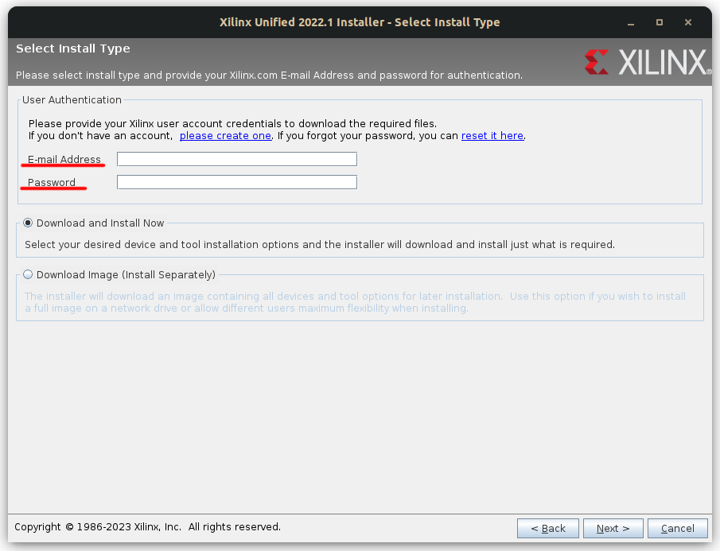
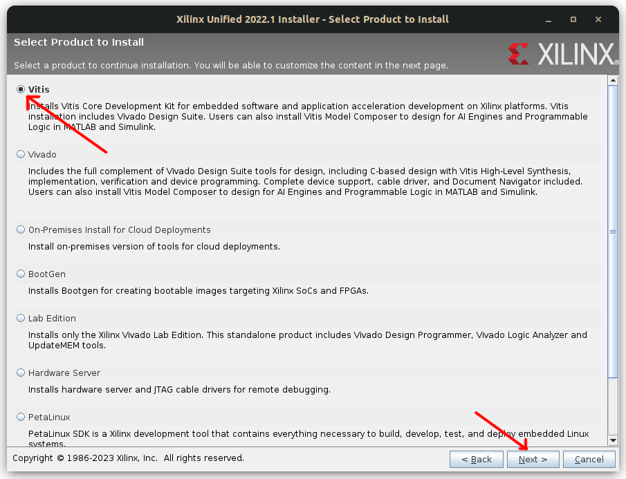
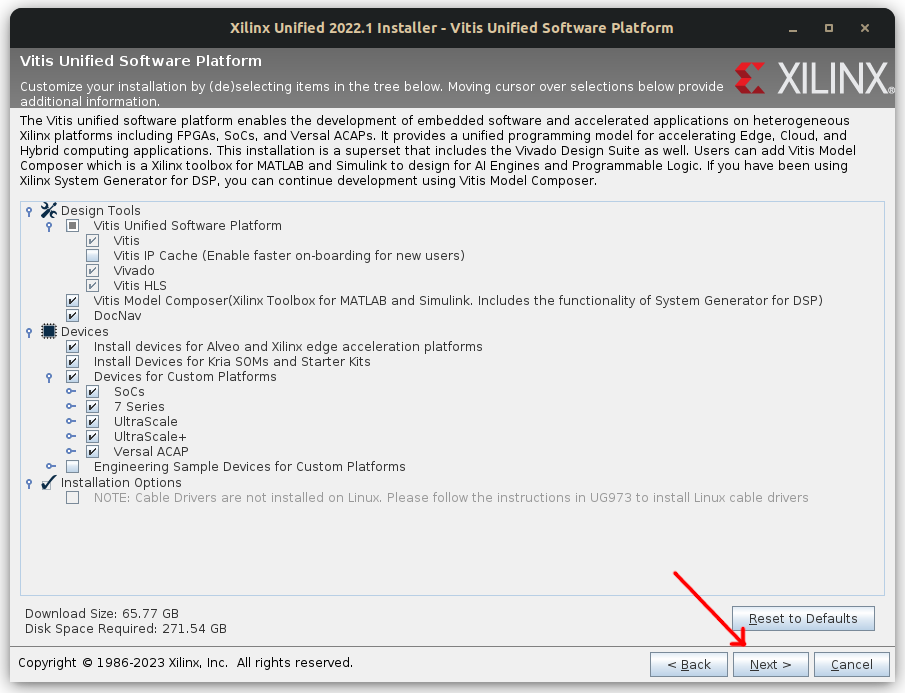
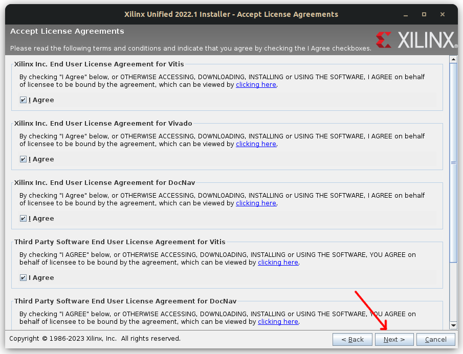
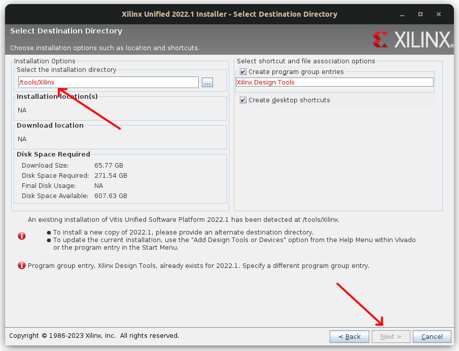

*Written By: Chris Anderson* <br>
*Last Updated: November 16, 2023*

# Installing Xilinx Suite Products
This process will take an extremely long time, regardless of internet access, computing power, etc. This should be done early on in development **AFTER** setting up the [dual-boot for linux](https://github.com/chrisanderson16/ACOM_Transmitter_FPGA_Dev/blob/main/environment_setup/README.md). <br>

This installation guide will give step-by-step instructions for installing Vitis and Vivado (and other Xilinx suite software) to the Ubuntu 22.4.3 LTS OS. Please note, this technically is *not* a supported distribution. However, throughout the time using this software on this version of Ubuntu, I have not encountered any errors. <br>

---

### What is Vitis and Vivado
This is an important starting point, even before installation. <br>
**Vivado** is professional FPGA firmware design software. This will be used to continue the development of the transmitter chain for the ACOM Transmitter FGPA. This software was introduced by Dr. J.F. Bousquet. It uses block diagrams and VHDL code to create logical representations of digital circuits on the FPGA. <br>

*How to actually use this software will be detail in the how to use Vivado* <br>

**Vitis** is similar to many microcontroller/FPGA IDE's. This meaning, it is similar to using an arduino in the sense that you need to instruct the system on what it should do, given the firmware's definition of the digital circuits. You must import a bitstream, obtained from Vivado, to provide the Vitis on what it can use.<br>
For this specific project, this should be used as test software, to test the Vivado projects. This is due to the fact that scanning user with Vitis will not work with Petalinux. 

---

## How to install Xilinx Suite
*This section will follow the steps required to install Vitis Vivado on Ubuntu 22.4.3 LTS. The version of Vivado and Vitis that will be used is 2022.1, as the previous transmitter chain was created in this version.*

1. Download the installer.
    + This requires you to create a Xilinx account. Go to the [Xilix website](https://www.xilinx.com/support/download/index.html/content/xilinx/en/downloadNav/vivado-design-tools/2022-1.html).
    + Click on the TAR installer. 
    
    + It will redirect you to login.
        + If you do not have an account, create on, and repeat previous steps.
    + It will ask you to enter information about yourself and your intentions with the software.
        + For civic address, you can use Sexton Campus' addresss.
    + At the bottom of the page, click **Download**

2. Install prerequisite libraries.
    + For the installation to *actually* complete, you must install some libraries before it begins.
    + Enter the following two commands into the terminal:
        ```sudo apt install libtinfo5```
        ```sudo apt install libncurses5```
    + Press *y* and *enter* to actually install the libraries.

3. Change Vivado installer file permissions.
    + Navigate to the directory the downloaded files from step 1 is.
    + In the terminal, enter:
        ```sudo chmod 777 [INSERT FILENAME HERE]```
        + Make sure to remove the brackets, [].

4. Begin Vivado and Vitis installation
    + Enter the following command in the directory that contains the downloaded installation file:
        ```./[INSERT FILENAME HERE]```
    + Follow the next images on the proper options to use: <br>

 <br>
 <br>
 <br>
 <br>
 <br>
 <br>
